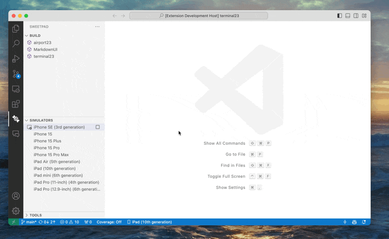

# SweetPad (iOS/Swift development) 

📚 [Documentation](https://sweetpad.hyzyla.dev/) | 📦
[VSCode Marketplace](https://marketplace.visualstudio.com/items?itemName=sweetpad.sweetpad) | 🐞
[Github Issues](https://github.com/KayodeOgundimu-DoorDashSWE/sweetpad/issues) | 🏔️ [Roadmap](https://github.com/KayodeOgundimu-DoorDashSWE/sweetpad/blob/main/TODO.md)

Develop Swift/iOS projects efficiently using VSCode or Cursor. SweetPad integrates essential iOS development tools to make VSCode/Cursor a viable alternative to Xcode.



## Features

### Development
- ✅ **[Autocomplete](https://sweetpad.hyzyla.dev/docs/autocomplete)** — Intelligent code completion using [xcode-build-server](https://github.com/SolaWing/xcode-build-server)
- 💅🏼 **[Format](https://sweetpad.hyzyla.dev/docs/format)** — Format Swift files using [swift-format](https://github.com/apple/swift-format) or other formatters
- 🔍 **Periphery Scan** — Detect unused code using [Periphery](https://github.com/peripheryapp/periphery) with smart public API retention
- 📦 **Swift Package Manager** — Full support for SPM package development and dependencies

### Build & Run
- 🛠️ **[Build & Run](https://sweetpad.hyzyla.dev/docs/build)** — Build and run applications using [xcodebuild](https://developer.apple.com/library/archive/technotes/tn2339/_index.html)
- 📱 **[Simulator](https://sweetpad.hyzyla.dev/docs/simulators)** — Create, manage and control iOS simulators
- 📱 **[Devices](https://sweetpad.hyzyla.dev/docs/devices)** — Deploy and run iOS applications on physical iPhone or iPad devices

### Testing & Debugging
- 🪲 **[Debug](https://sweetpad.hyzyla.dev/docs/debug)** — Debug iOS applications using [CodeLLDB](https://marketplace.visualstudio.com/items?itemName=vadimcn.vscode-lldb)
- ✅ **[Tests](https://sweetpad.hyzyla.dev/docs/tests)** — Run tests on simulators and devices with visual feedback
- 🧪 **[Swift Testing](./docs/wiki/swift-testing.md)** — Support for Swift Testing framework (Xcode 16+) alongside XCTest

### Tools
- 🛠️ **[Tools](https://sweetpad.hyzyla.dev/docs/tools)** — Manage essential iOS development tools using [Homebrew](https://brew.sh/)
- 🔍 **Periphery Integration** — Install and manage Periphery for unused code detection

### Periphery Scan Usage

SweetPad integrates [Periphery](https://github.com/peripheryapp/periphery) to help you identify unused code in your Swift projects:

**Context Menu Integration:**
- Right-click on any scheme in the workspace tree
- Select **"Periphery Scan"** for quick analysis
- Select **"Build & Periphery Scan"** for full build + scan workflow
- Select **"Create Periphery Config"** to generate a `.periphery.yml` configuration file

**Configuration Options:**
- `periphery.runAfterBuild` — Automatically run scan after builds
- `periphery.retainPublic` — Keep public APIs (enabled by default)
- `periphery.retainObjcAccessible` — Keep Objective-C accessible code (enabled by default)
- `periphery.format` — Output format (default: "xcode")

**Configuration Priority:**
1. `.periphery.yml` in project root (checked first)
2. Custom path specified in `periphery.config` setting
3. User-prompted path selection
4. Default settings if no configuration is found

**Installation:**
Periphery is automatically managed through the Tools panel or install manually:
```shell
brew install periphery
```

> 💡 Have ideas or found issues? Please open an issue or start a discussion on the [SweetPad GitHub repository](https://github.com/KayodeOgundimu-DoorDashSWE/sweetpad).

## Requirements

1. 🍏 MacOS — Other platforms are currently not supported
2. 📱 Xcode — Required for building and running iOS apps via `xcodebuild`

## Installation

### VSCode Marketplace
Install directly from the [VSCode Marketplace](https://marketplace.visualstudio.com/items?itemName=sweetpad.sweetpad).

### Manual Installation
Download the latest `.vsix` file from [GitHub Releases](https://github.com/KayodeOgundimu-DoorDashSWE/sweetpad/releases) and install with:

```shell
code --install-extension sweetpad-[version].vsix
# or for Cursor
cursor --install-extension sweetpad-[version].vsix
```

## Development

### 🛠️ **Local Development Setup**

1. Clone the repository:
```shell
git clone git@github.com:KayodeOgundimu-DoorDashSWE/sweetpad.git
cd sweetpad
```

2. Install dependencies:
```shell
npm install
```

3. Open the project in Visual Studio Code:
```shell
code .
```

4. Press **F5** to build and run the extension in a new development window.

5. Add breakpoints to the code where you want to debug.

6. When you perform actions that trigger those breakpoints, the extension will pause, allowing you to inspect variables and the call stack.


## 🔥 Build Locally

To build and test changes locally:

```bash
# Clone the repository
git clone https://github.com/KayodeOgundimu-DoorDashSWE/sweetpad.git
cd sweetpad

# Install dependencies
npm install

# Build and install the extension locally
./scripts/install-and-test.sh
```

#### **What the build script does:**
1. 🔨 **Builds** the extension from source
2. 📦 **Creates** a VSIX package with dynamic versioning
3. 🚀 **Installs** the extension automatically in VS Code or Cursor
4. 🔄 **Reloads** the editor window to activate the extension

## Changelog

See [CHANGELOG.md](./CHANGELOG.md) for all notable changes to the extension.

## License

This extension is licensed under the [MIT License](./LICENSE.md).
