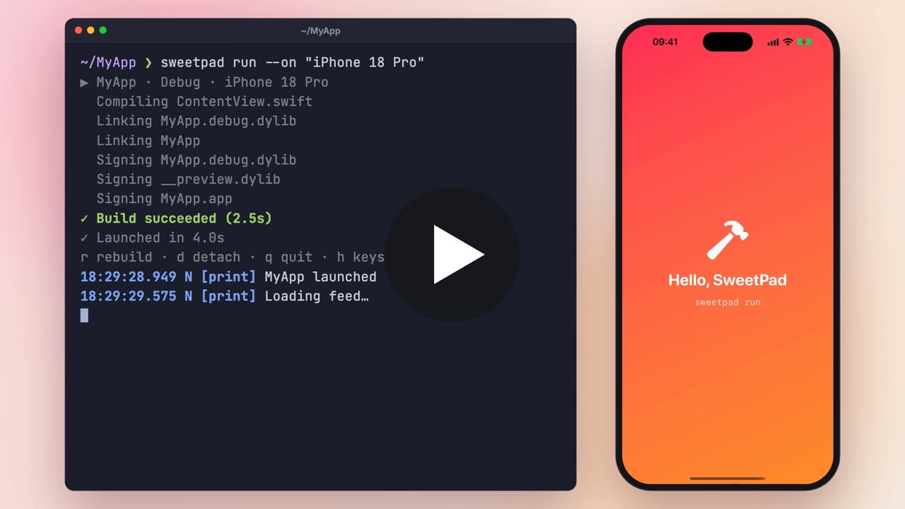

# SweetPad 

**xcodebuild for humans and agents.**

A command-line tool that builds, runs, debugs, and tests apps for iOS, macOS, etc. without opening
Xcode. It works with Xcode projects and workspaces, Tuist, XcodeGen, and Swift
packages.

[](./sweetpad-docs/static/videos/sweetpad-demo-readme.mp4)

```bash
brew install sweetpad-dev/tap/sweetpad

cd MyApp
sweetpad run                        # build, install, launch, and stream logs
sweetpad run --on "iPhone 16 Pro"   # pick a simulator or device
sweetpad test --on booted           # test on the simulator that is already booted
```

The first run asks for a scheme and a destination and saves the answers. While `run` is active,
press `r` to rebuild or `q` to quit.

## Features

- [Pleasant to use](https://sweetpad.hyzyla.dev/docs/cli/overview): short commands, prompts in place
  of required flags, and built-in help for every command.
- [Short build output](https://sweetpad.hyzyla.dev/docs/cli/build-and-run): a small app's build
  prints 7 lines, where `xcodebuild` prints 350.
- [Destinations](https://sweetpad.hyzyla.dev/docs/cli/destinations): simulators, connected devices,
  and the Mac, picked by name with `--on`.
- [Testing](https://sweetpad.hyzyla.dev/docs/cli/testing): run a single test, rerun failures, retry
  flaky tests, and export coverage and JUnit reports.
- [Autocomplete](https://sweetpad.hyzyla.dev/docs/cli/autocomplete): `sweetpad bsp init` sets up
  SourceKit-LSP for Neovim, Zed, Helix, and Emacs.
- [Hot reload](https://sweetpad.hyzyla.dev/docs/cli/hot-reload): `sweetpad run --hot` applies saved
  Swift changes without restarting the app.
- [Debugging](https://sweetpad.hyzyla.dev/docs/cli/app-lifecycle): scripted lldb sessions, waiting
  for a log line, and structured crash reports.
- [Scripts and CI](https://sweetpad.hyzyla.dev/docs/cli/scripts-and-ci): JSON output and specific
  exit codes on every command.
- [Agent skills](https://sweetpad.hyzyla.dev/docs/cli/agent-skills): instructions that teach coding
  agents to use the CLI.

## More

Documentation: [sweetpad.hyzyla.dev](https://sweetpad.hyzyla.dev/docs/cli/getting-started)

There is also a [VS Code extension](https://marketplace.visualstudio.com/items?itemName=sweetpad.sweetpad).
The CLI does not depend on it.

Sponsor: [GitHub Sponsors](https://github.com/sponsors/sweetpad-dev) ·
[Buy Me a Coffee](https://www.buymeacoffee.com/hyzyla)

License: [MIT](./LICENSE.md)
