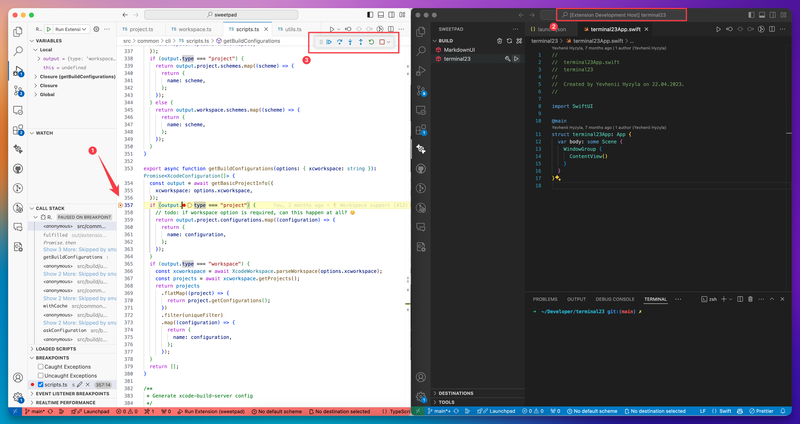

# Debug extension

This guide explains how to install and debug the extension on your local machine for your project.

1. Clone the repository:

```shell
git clone git@github.com:KayodeOgundimu-DoorDashSWE/sweetpad.git
```

2. Go to the extension directory:

```shell
cd sweetpad
```

3. Install dependencies:

```shell
npm install
```

4. Open the project in Visual Studio Code:

```shell
code .
```

5. Press **F5** to build and run the extension in a new window. You should now see two VSCode windows: one with the
   extension running and the other with the source code. The window with **[Extension Development Host]** in the title
   is where the extension is running.

6. Return to the source code window and add breakpoints to the code where you want to debug.

7. Switch to the window with the running extension and restart it by pressing **Cmd+R**.

8. Now, when you perform the action that triggers the breakpoint, the extension will pause, and you can inspect the
   variables and the call stack in the source code window.

On example below you can see:

1. How breakpoints are set in the source code.
2. How "[Extension Development Host]" window looks like.
3. How to continue, pause, and stop the debugging session.


