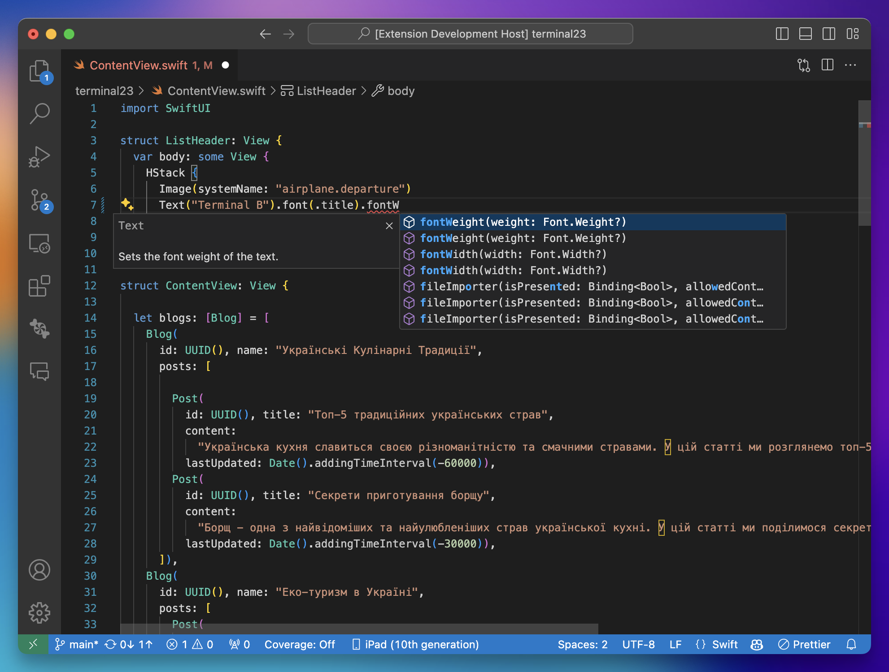

# SweetPad: Autocomplete with xcode-build-server

This extension helps you to integrate Xcode with SourceKit-LSP for autocomplete functionality.



## Installation

1. install [Swift](https://marketplace.visualstudio.com/items?itemName=sswg.swift-lang) from the marketplace and and
   [xcode-build-server](https://github.com/SolaWing/xcode-build-server) using Homebrew:

```bash
brew install xcode-build-server --head
```

2. Now create config file `buildServer.json` in the root of your project by running command: **"SweetPad: Create Build
   Server Config"** from the command palette.

3. Then you have to build project in order to create build logs which are parsed by xcode-build-server and sent to
   SourceKit-LSP

After that you autocmplete should work ✅
