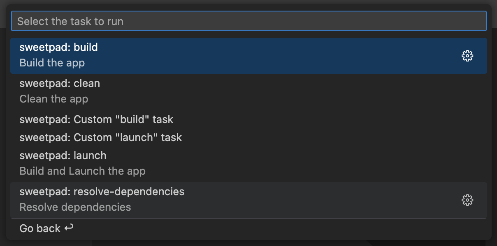

# SweetPad: Build & Run app on iOS Simulator

You can build and run your iOS app directly on the simulator or device from the VSCode sidebar. This functionality
leverages `xcodebuild`, a component of the Xcode command-line tools.


To build and run your app on the simulator or device, first open the folder containing your Xcode project. Then, open
the SweetPad tools panel on the left side of VSCode, navigate to the **"Build"** section, and click the **"Build &
Run"** button next to the schema name ▶️. The extension will prompt you to select a simulator or device, and then it
will build and run your app on the chosen simulator or device.

For better output, I highly recommend installing `xcbeautify` as well:

```bash
brew install xcbeautify
```

Alternatively, you can use the **"Tools"** section in the SweetPad panel to install `xcbeautify` and other essential
iOS.

## Main parts of the "Build" section:

[](../images/build-preview.png)

1. ▶️ **Build & Run** — Click the play `▶️` button next to the schema name to build and run the app on the simulator or
   device.
2. ⚙️ **Build** — Click the gear `⚙️` button next to the schema name just to build the app.
3. **SweetPad: Clean** — right-click on the schema name to see the "Clean" option. This option will clean the build
   folder and derived data.
4. **SweetPad: Resolve Dependencies** — right-click on the schema name to see the "Resolve Dependencies" option. This
   option will resolve the dependencies using Swift Package Manager.

   

> ⚠️ This feature is currently in alpha and may not perform as expected. Should you encounter any issues, please report
> them by opening an issue on the SweetPad GitHub repository.

## Tasks

SweetPad also provide TaskProvider that automatically provides tasks for building and running the app on the simulator
or device. You can run these tasks from the command palette by typing `Tasks: Run Task` and selecting the desired task.



Or you can add tasks to the `tasks.json` file in the `.vscode` folder of your project:

```jsonc
{
  "version": "2.0.0",
  "tasks": [
    {
      "label": "SweetPad: Build",
      "type": "sweetpad",
      "action": "launch",
      "scheme": "terminal23",
      "configuration": "Debug",
    },
  ],
}
```

## Set Xcode workspace path

If you are working on multiple Xcode workspaces, you can set the workspace path in the SweetPad configuration:

```jsonc
{
  // Path to your Xcode workspace (.xcworkspace file)
  // The path can be absolute or relative to the folder in which VSCode is opened.
  "sweetpad.workspacePath": "/path/to/your/workspace",
  // Examples:
  // "sweetpad.workspacePath": "terminal23.xcodeproj/project.xcworkspace"
  // "sweetpad.workspacePath": "terminal23.xcworkspace"
  // "sweetpad.workspacePath": "/Users/username/Projects/terminal23.xcworkspace"
}
```

To simplify the process, you can use the `> SweetPad: Select Xcode Workspace` command from the command palette to select
the workspace and save it in the configuration.

If the configuration is not provided, the extension will ask you to select the workspace the first time you run the
build task and will save it in the extension cache. To clean the cache, you can use the
`> SweetPad: Reset Extension Cache`

> **Note:** If you are working on a project that contains only one Xcode workspace, the extension will automatically
> detect it and use it to build and run the app. You don't need to set the workspace path in the configuration.
