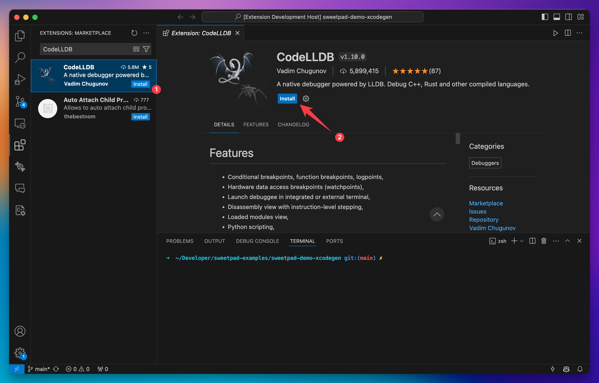
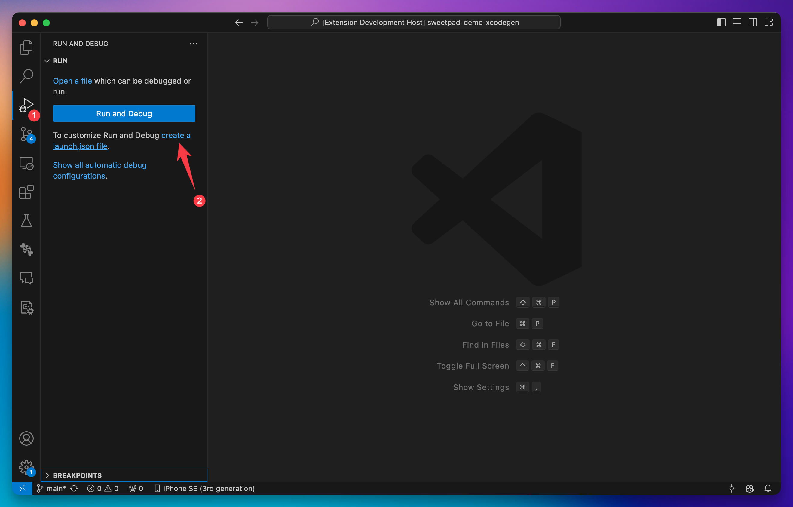
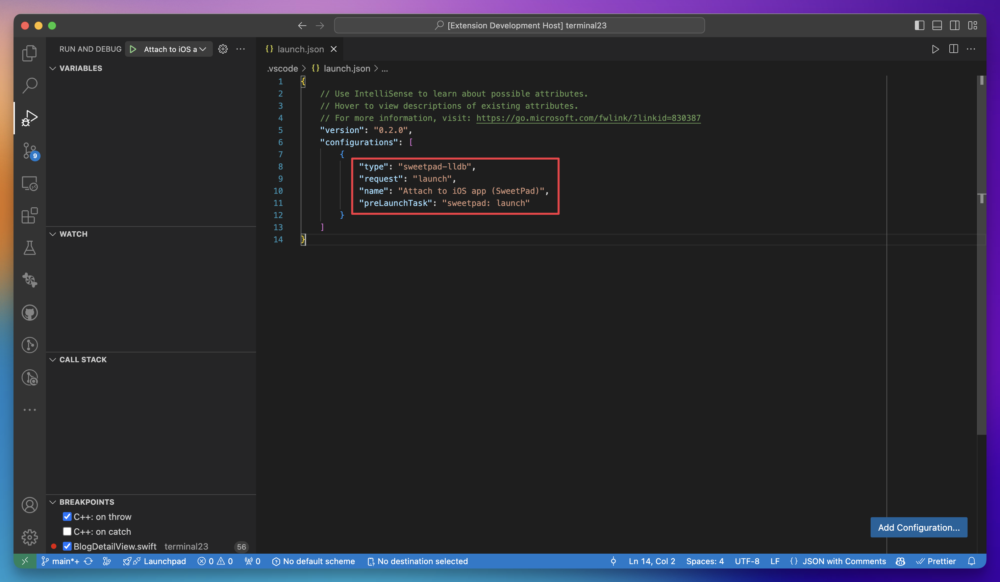
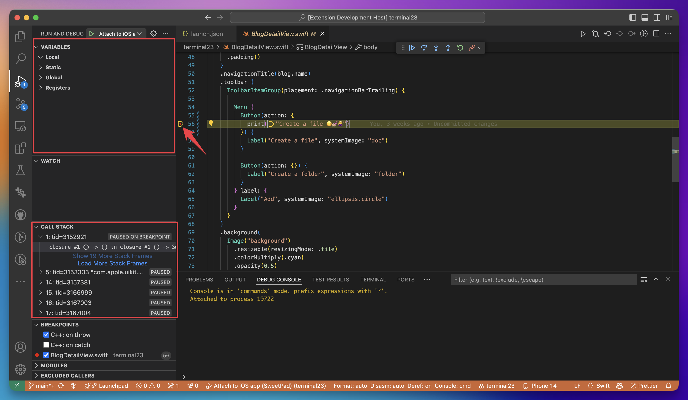

# Debugging iOS application

To debug an iOS application extension, provide thin integration with the
[CodeLLDB](https://marketplace.visualstudio.com/items?itemName=vadimcn.vscode-lldb) extension, powered by
[LLDB](https://lldb.llvm.org/).

## Tutorial

1. Install the [CodeLLDB](https://marketplace.visualstudio.com/items?itemName=vadimcn.vscode-lldb) extension from the
   Visual Studio Code marketplace.



2. Create a `launch.json` configuration file in the `.vscode` directory of your project. The configuration file should
   contain the following configuration:

```json
{
  "version": "0.2.0",
  "configurations": [
    {
      "type": "lldb",
      "request": "attach",
      "name": "Attach to iOS Simulator",
      "waitFor": true,
      "program": "${command:sweetpad.debugger.getAppPath}"
    }
  ]
}
```





> Do you notice the `${command:sweetpad.debugger.getAppPath}`? This is a command that will be executed before debugging
> starts and will return the path to the application that was recently built by SweetPad. That path is required by the
> CodeLLDB extension in order to attach to the running application. You can read more about the CodeLLDB debugger
> options in the [official documentation](https://github.com/vadimcn/codelldb/blob/master/MANUAL.md).

3. Start the iOS simulator and run the application using the SweetPad "Launch" command on the "Build" panel. Wait until
   the application is launched on the simulator.


4. Attach the debugger to the running application by clicking on the "Attach to iOS Simulator" configuration on the
   Debug panel. It takes a few seconds to attach the debugger to the running application. If you see the "Call Stack"
   panel with the list of threads and frames, then the debugger is successfully attached.


5. Now set breakpoints in your code and start debugging your application. Next time, you can just attach the debugger to
   the running application without the previous steps.


