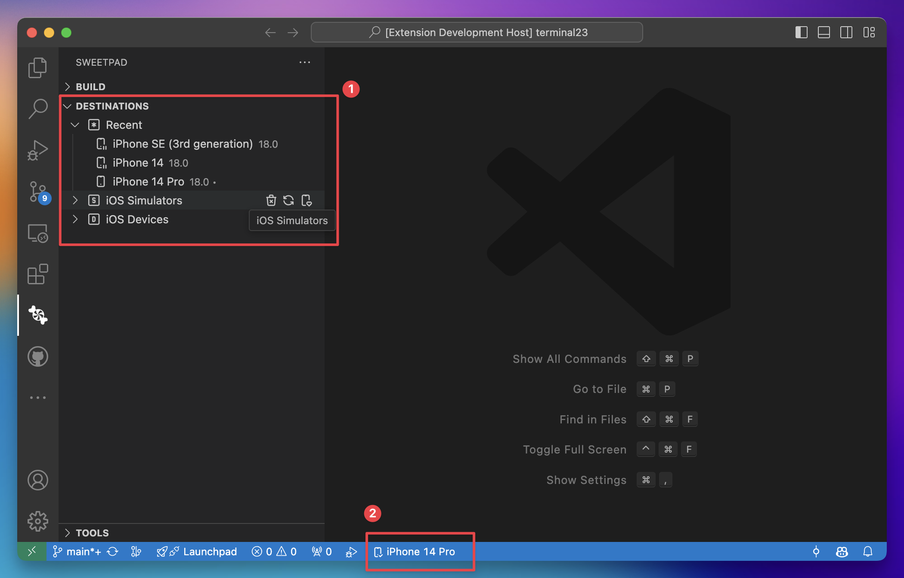
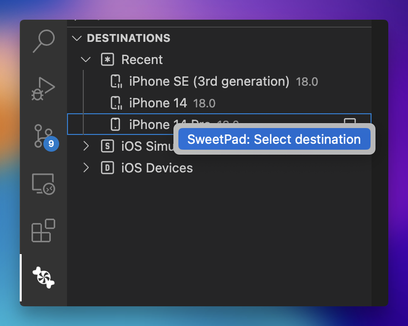
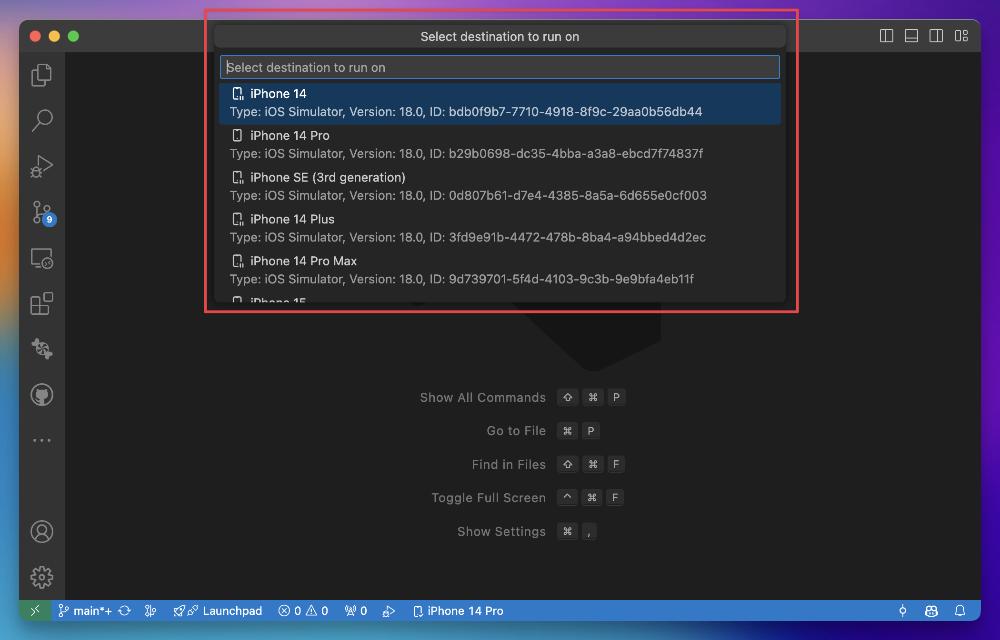

# SweetPad: Destinations Manager

In SweetPad, a "destination" refers to a device on which you can run your app, such as a specific simulator or a
connected device. Under the hood, SweetPad uses `xcrun simctl` and `xcrun devicectl` commands to manage simulators and
devices.

On the extension sidebar, you can see the destination manager, which consolidates all available destinations in one
place **[1]**. It is divided into three sections:

- **Recent** - A list of recently used destinations.
- **Simulators** - A list of available simulators.
- **Devices** - A list of connected devices.

There is also a status bar item at the bottom of the VSCode window that shows the currently selected destination and
allows you to quickly change it **[2]**.

## How to Select a Destination to Run Your App

To select a destination to run your app, you can use one of the following methods:

1. Click on the destination status bar item at the bottom of the VSCode window and select a destination from the list.

2. Right-click on the destination in the sidebar and select `Set as active destination` from the context menu.

3. Simply run your app, and the extension will prompt you to select a destination from the list.

## Related Documentation

- [SweetPad: iOS Simulator/Emulator Manager](simulator.md)
- [SweetPad: iOS Device Manager](devices.md)
