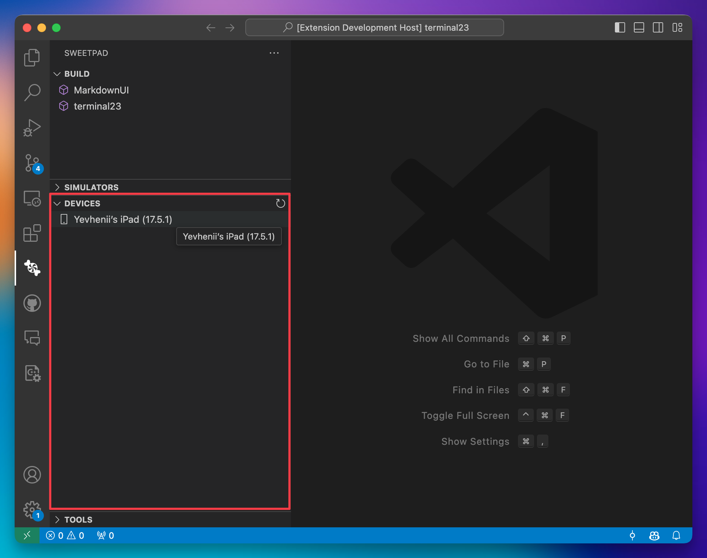
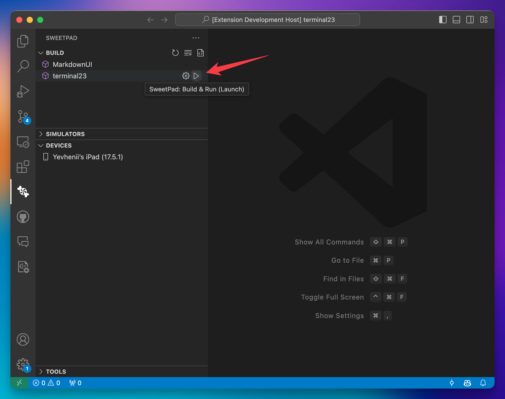
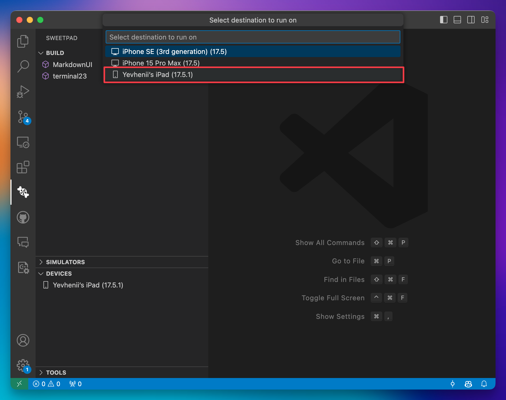
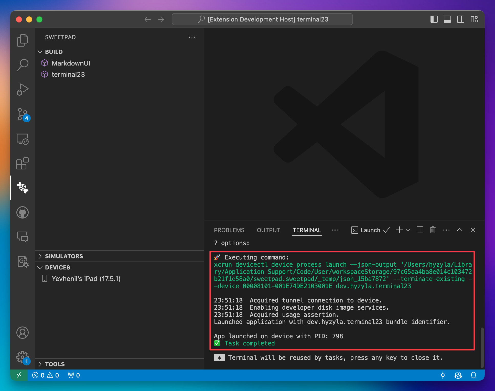
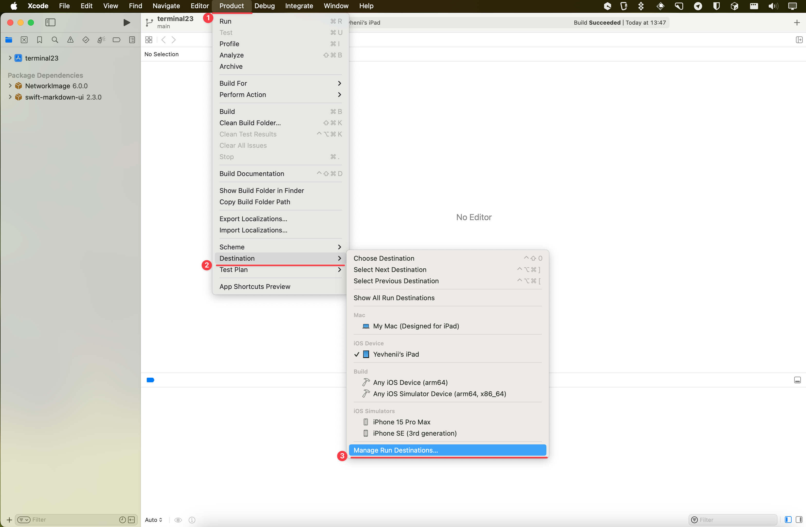
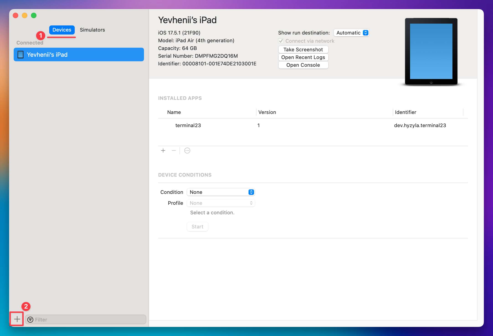

# SweetPad: iOS device manager

Currently, SweetPad does not support much functionality for managing iOS devices. However, the extension provides basic
integration with the devicectl command to run the app on the device.

## Limitations

1. You have to pair with the device using Xcode manually.
2. It works only with **iOS 17** and **Xcode 15** or later.
3. Logs and debugging from the device are currently not supported.

## How to Run on the Device

1. Check that there are connected devices on the "Devices" panel of the extension.
   
2. Click the `SweetPad: Build and Run (Launch)` command next to the scheme name.
   
3. Select the device from the list of simulators and connected devices. 
4. Wait until the app is installed and launched on the device (the device should be unlocked).
   

## How to Add a New Device

To add a new device, you need to use Xcode. Usually, this should be done once, and then the device will be available
every time you connect it to the computer using USB or when your device is connected to the same network as your
computer.

1. Open Xcode and go to `Product` -> `Destination` -> `Manage Run destination.`
   
2. Click the `+` button in the bottom left corner 
3. Follow the instructions in the Xcode window to pair the device.

## How It Works

SweetPad utilizes Xcode's `xcrun devicectl` command that was introduced in Xcode 15. This command allows managing
devices from the command line. We utilize the following commands to handle devices:

```
xcrun devicectl list devices
xcrun devicectl device install app --device <udid> <path>
xcrun devicectl device launch app --terminate-existing --device <udid> <bundle_id>
```
