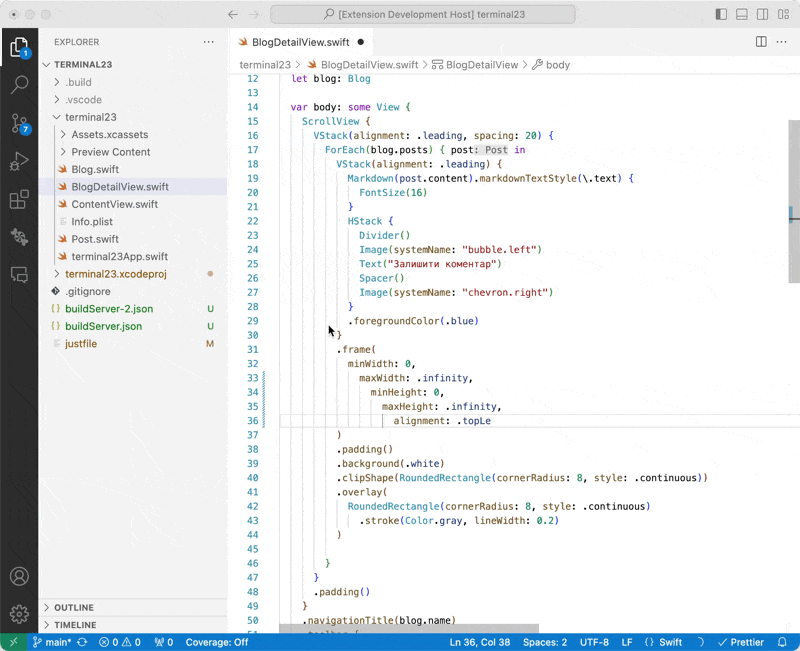

# SweetPad: Format Swift code

This extension integrates [**swift-format**](https://github.com/apple/swift-format) with VSCode for formatting Swift
files. You can also enable "Format on Save" to format Swift files automatically when saving.

[](../images/format-demo.gif)

### Installation

To use this feature, first install **swift-format** using Homebrew:

```bash
brew install swift-format
```

Next, add the following configuration to your settings.json file:

```json
{
  "[swift]": {
    "editor.defaultFormatter": "sweetpad.sweetpad",
    "editor.formatOnSave": true
  }
}
```

Then, open your Swift file and press `⌘ + S` to format it 💅🏼

> 🙈 In case of errors, open the Command Palette with `⌘ + P` and run `> SweetPad: Show format logs`. This command will
> open an "Output" panel displaying logs from swift-format. If you encounter issues, grab the logs and open an issue on
> the SweetPad GitHub repository.
