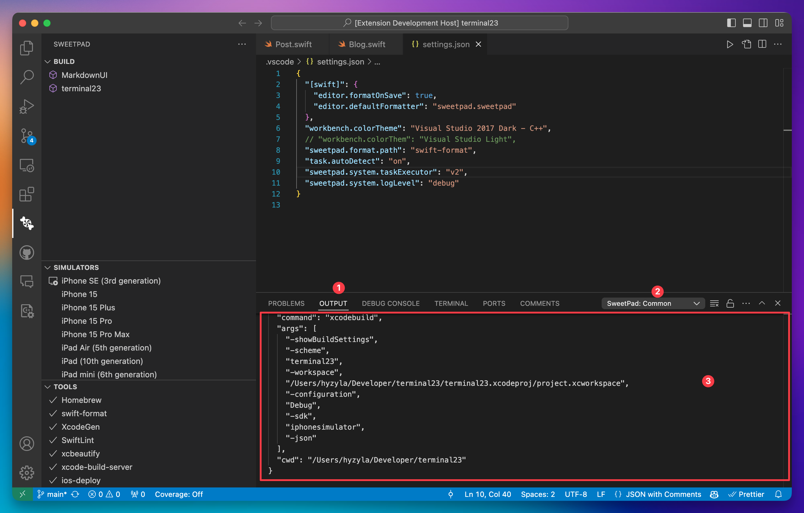

# Troubleshooting

1. Set up "debug" level logging in the configuration file to show debug messages in the output panel.

```json
{
  "sweetpad.system.logLevel": "debug"
}
```

2. Restart Visual Studio Code to apply the changes.

3. Check the "Output" panel for debug messages.


