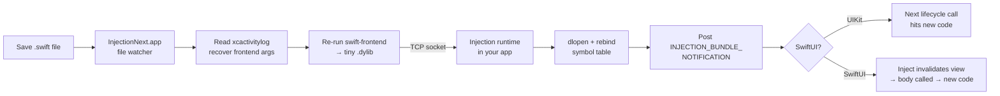

# Hot reload

Hot reload lets you change Swift code and see the result in your running app
**without rebuilding or relaunching**. Save the file, blink, and the simulator
already shows your update.

SweetPad wires up the open-source [InjectionNext](https://github.com/johnno1962/InjectionNext)
project for you so you don't have to touch Xcode build settings or your
AppDelegate — flip a setting, restart the app once, and you're set.

:::info

Hot reload only works on **iOS / tvOS / visionOS Simulators** and the **macOS**
target. Physical devices cannot load the injection dylib because Apple's code
signing strips the mechanism it uses. **watchOS is not supported** — InjectionNext
does not ship a watchOS injection library.

:::

## How it works (in one paragraph)

InjectionNext is a small Mac app that watches your Swift files. When you save
one, it recompiles just that file into a tiny dynamic library and tells your
running app to load it. Your views and methods get swapped out live.

For the trick to work, three things need to be true: the app has to be linked
with a special flag (`-Xlinker -interposable`), it has to load the InjectionNext
dylib at launch, and your SwiftUI views need two one-line annotations. SweetPad
handles the first two; you do the third.

## Setup

### 1. Install InjectionNext

Open the **SweetPad** activity bar in the left sidebar, expand the **Tools**
view, and click the install icon next to **InjectionNext**. That opens the
GitHub releases page. Download the zip, unzip it, and drag the app into
`/Applications/`.

You can also do this from the command line:

```bash
curl -L -o /tmp/InjectionNext.zip \
  https://github.com/johnno1962/InjectionNext/releases/latest/download/InjectionNext.zip
unzip -d /tmp /tmp/InjectionNext.zip
mv /tmp/InjectionNext.app /Applications/
```

InjectionNext is not available on Homebrew — the GitHub releases page is the
only distribution channel.

You don't need to launch the app yourself. SweetPad will start it when you run
your app.

### 2. Turn on hot reload in SweetPad

Open VS Code settings (`⌘,`), search for **sweetpad hot reload**, and check
**Sweetpad › Hot Reload: Enabled**.

```json title=".vscode/settings.json"
{
  "sweetpad.hotReload.enabled": true
}
```

When the setting is on, SweetPad does three things to your build and launch
environment.

**Build flags.** It appends `OTHER_LDFLAGS=$(inherited) -Xlinker -interposable`
to xcodebuild so the linker emits Swift functions as interposable symbols, plus
`EMIT_FRONTEND_COMMAND_LINES=YES` so Xcode 16.3+ logs the per-file frontend
invocations InjectionNext needs to recompile with.

**Launch env.** It sets `DYLD_INSERT_LIBRARIES` on the simulator/macOS launch so
the injection dylib loads automatically (no AppDelegate changes), and
`INJECTION_PROJECT_ROOT` to your workspace folder so InjectionNext starts
watching the right directory.

**Framework paths.** It prepends your active Xcode's platform directories to
`DYLD_FRAMEWORK_PATH` and `DYLD_LIBRARY_PATH`, so the injection dylib's XCTest
dependencies resolve even when Xcode lives at a non-default path
(e.g. `/Applications/Xcode-26.0.1.app`).

It also opens the InjectionNext app for you if it isn't already running.

### 3. Add the Inject package to your project (SwiftUI only)

For SwiftUI views to refresh when you save, you need Krzysztof Zabłocki's
[Inject](https://github.com/krzysztofzablocki/Inject) package. Add it via
Swift Package Manager:

- **In Xcode:** _File → Add Package Dependencies…_, paste
  `https://github.com/krzysztofzablocki/Inject` and add it to your app target.
- **In Package.swift:** add it to the `dependencies` array and to your target's
  `dependencies`.

UIKit apps don't need the Inject package — method bodies are swapped
automatically.

### 4. Annotate your SwiftUI views

In every view you want to hot-reload, add two lines:

```swift title="ContentView.swift"
import SwiftUI
import Inject

struct ContentView: View {
  // highlight-next-line
  @ObserveInjection var inject

  var body: some View {
    Text("Hello, hot reload!")
      // highlight-next-line
      .enableInjection()
  }
}
```

InjectionNext rebinds the function symbols in the running process, but SwiftUI
caches the result of `body` and only rebuilds it when an observed input changes.
The two annotations close that gap.

`@ObserveInjection` is a property wrapper that subscribes the view to
InjectionNext's notifications, which is what makes SwiftUI treat the view as
invalidated when injection fires.

`.enableInjection()` ensures the injection runtime is loaded and wraps the view
in `AnyView`. The wrap matters because injection can change the static shape of
the returned view tree, and without type-erasing, a structural change between
old and new `body` can trip SwiftUI's diff.

:::tip
You only need this on views you actively edit. A common pattern is to add it
to your top-level view and to whichever subviews you're iterating on.
:::

### Avoiding per-view boilerplate

There's no truly global "turn on hot reload for every SwiftUI view" flag —
SwiftUI's `View` is a protocol on value types, so there's no place to subscribe
everything at once the way you would in UIKit. Two practical shortcuts.

#### Option A — Annotate only the root view

Put `@ObserveInjection` and `.enableInjection()` on a single top-level view.
When injection fires, SwiftUI invalidates from the root down, so *any* edit
anywhere in the tree gets picked up:

```swift
@main
struct MyApp: App {
  var body: some Scene {
    WindowGroup {
      RootView()
    }
  }
}

struct RootView: View {
  // highlight-next-line
  @ObserveInjection var inject

  var body: some View {
    ContentView()      // and everything below it
      // highlight-next-line
      .enableInjection()
  }
}
```

Trade-off: every save re-renders the entire tree, not just the changed view.
Fine for most apps, noticeable in very large ones. Child views don't need
anything.

#### Option B — Let InjectionNext add the markers for you

The InjectionNext menu bar has a **Prepare SwiftUI** submenu with two items.
**Last Injected** patches the most recently injected file. **Prepare Project**
walks every Swift file in the project. Both insert `@ObserveInjection` and
`.enableInjection()` automatically.

Run it once after adding the Inject package and it does the editing pass for
you.

## Try it

1. Run your app on a simulator using **SweetPad: Build & Run (Launch)**.
2. Watch the console for a banner like
   `🔥 InjectionNext: arm64 iPhoneSimulator connected to app, waiting for commands.`
   The InjectionNext menu-bar icon should turn orange.
3. Open `ContentView.swift` in VS Code.
4. Change `"Hello, hot reload!"` to `"Hello, world!"` and save.
5. Watch the console for `🔥 ✅ Hot reload complete - Rebound N symbols` — the
   simulator updates within a second.

If nothing happens, jump to [Troubleshooting](#troubleshooting).

## Settings reference

| Setting                         | Default | What it does                                                                                                  |
| ------------------------------- | ------- | ------------------------------------------------------------------------------------------------------------- |
| `sweetpad.hotReload.enabled`    | `false` | Master switch. Enables the linker flag, build settings, and dylib injection.                                  |
| `sweetpad.hotReload.dylibPath`  | `null`  | Override the path to the injection dylib. Leave blank unless InjectionNext is installed in a custom location. |

By default SweetPad picks the right dylib for your target:

- **iOS Simulator** → libiphonesimulatorInjection.dylib
- **tvOS Simulator** → libappletvsimulatorInjection.dylib
- **visionOS Simulator** → libxrsimulatorInjection.dylib
- **macOS** → libmacosxInjection.dylib

All of those live inside `/Applications/InjectionNext.app/Contents/Resources/`.

## Troubleshooting

### Nothing happens when I save a file

A few things to check.

**Did you `.enableInjection()` on the view?** SwiftUI views without that
modifier won't redraw even though the new code has been loaded. If you see
`🔥 ✅ Hot reload complete` in the console but nothing on screen, this is the
cause.

**Is the InjectionNext app actually running?** The menu-bar icon should be
visible and orange. Full state table:

- **Blue** — idle (started, no client connected)
- **Orange** — OK (client connected)
- **Green** — busy (compiling)
- **Yellow** — error (last compile failed)
- **Purple** — Xcode launched via the app (you won't see this under SweetPad)

**Look at the InjectionNext log window.** Click the menu-bar icon → **Show
Log**. If there are compile errors there, they explain why a particular save
didn't apply.

### dyld: Library not loaded @rpath/XCTest at launch

The injection dylib links against XCTest frameworks shipped with Xcode.
SweetPad points `DYLD_FRAMEWORK_PATH` and `DYLD_LIBRARY_PATH` at the active
Xcode resolved via `xcode-select -p`. If that's pointing at the wrong Xcode
(or no Xcode at all), the launch will fail. Fix with:

```bash
sudo xcode-select -s /Applications/Xcode.app/Contents/Developer
```

(Substitute the path to whichever Xcode you actually want to use.)

### The build fails with linker errors

This usually means the project is already setting `OTHER_LDFLAGS` in a way
that conflicts with `$(inherited)`. As a workaround, turn off
`sweetpad.hotReload.enabled` and add `-Xlinker -interposable` to **Other
Linker Flags** for the Debug configuration manually in Xcode.

### I want this for Release builds

Don't. `-Xlinker -interposable` makes every Swift function call go through an
extra indirection, which is fine in Debug but wastes performance in Release.
Turn the setting off when you're cutting a Release build.

### I'm running on a real device

Hot reload won't work there. Apple's code signing prevents `DYLD_INSERT_LIBRARIES`
from loading on signed apps. Use the simulator for hot-reload-driven iteration
and the device for final validation.

### I'm targeting watchOS

InjectionNext doesn't ship a watchOS injection library, so watch Simulator
targets launch without injection. SweetPad logs a warning to the output channel
and otherwise behaves as if hot reload were off.

## How it actually works

The one-paragraph version at the top of this page is true but cartoonish. If
you want to understand why the setup looks the way it does — and what's likely
to break — this section walks the full pipeline.

### The injection cycle

Every save triggers the same sequence:



The six steps:

#### 1. File watcher

The InjectionNext app is watching the directory you pointed it at — via the
`INJECTION_PROJECT_ROOT` env var SweetPad sets, or its **…or Watch Project**
menu item if you set it up by hand. It sees a Swift file was modified.

InjectionNext is running in "file-watcher / log parsing" mode here. It has two
other modes — supervising Xcode for SourceKit logs, and patching the
swift-frontend binary directly — neither of which SweetPad uses.

#### 2. Recover the compile command

To rebuild that one file the same way Xcode would, InjectionNext needs the
exact arguments: same SDK, target triple, module name, preprocessor defines,
search paths. It recovers them by walking the most recent `.xcactivitylog`
files in your project's DerivedData `Logs/Build/` directory and pulling out the
per-file Swift frontend invocation.

From Xcode 16.3 onward, that invocation only appears in the log when the
project sets `EMIT_FRONTEND_COMMAND_LINES=YES`. SweetPad injects that build
setting automatically when hot reload is on.

#### 3. Re-run the compiler

It re-invokes swift-frontend (the actual compiler binary that swiftc wraps),
passing the recovered args plus a `-primary-file` for the one source you just
saved and a fresh `-o` path. The result is a single dylib for just that file,
instead of contributing to the main binary.

This is the slow part of the cycle — typically 200ms to 2s, depending on file
complexity and module size.

#### 4. Push to the running app

The InjectionNext app holds a TCP socket open to the injection runtime that
loaded inside your app at launch (via
`DYLD_INSERT_LIBRARIES=lib<platform>Injection.dylib`). The runtime auto-connects
on load, and the freshly-built dylib's path is sent over that socket.

#### 5. dlopen + rebind

The injection runtime dlopens the new dylib and rewrites symbol pointers so
that any future call to an old function lands in the new code instead. Three
mechanisms work in concert:

- For free functions and value-type methods, it uses a bundled copy of
  Facebook's fishhook to walk the Mach-O lazy and non-lazy symbol-pointer
  tables in every loaded image and rewrite the entries. This is the "interpose"
  step — and the part that requires `-Xlinker -interposable`.
- For non-final Swift class methods, it overwrites the vtable slots in the
  class metadata directly via memory writes. No linker flag needed; class
  metadata is mutable at runtime.
- For `@objc` methods, it uses ObjC method swizzling — replacing entries in
  the runtime's method table.

#### 6. Notify subscribers

The runtime posts `INJECTION_BUNDLE_NOTIFICATION` on the default
`NotificationCenter`.

UIKit doesn't need this signal — the next view lifecycle call (`viewDidLoad`,
a scroll handler, an action method) will land in the new code naturally.
SwiftUI does need it, because of the caching behavior covered next.

### Why -Xlinker -interposable is necessary

By default, Swift function calls inside the same module are resolved at link
time to direct addresses baked into the executable. Once linked, those calls
cannot be redirected — there's no level of indirection to swap.

`-Xlinker -interposable` tells the linker to instead emit each Swift function
as a lazily-bound symbol, the same way C library functions are called via the
lazy stub table. The injection runtime rewrites entries in that stub table,
and the next call goes through the new pointer.

Without the flag, fishhook has nothing to rewrite. Two paths still work
without it: non-final class methods, swapped by patching the Swift class
metadata's vtable; and `@objc` methods, swapped via the Objective-C runtime's
method table. Everything else — value types, free functions, final-class
methods — becomes uninjectable. The InjectionNext README puts it the same way:
*"Otherwise, you will only be able to inject non-final class methods."*

### Why Inject is needed for SwiftUI

InjectionNext rebinds function symbols. That's enough for UIKit/AppKit: when
iOS next calls a view-controller lifecycle method or an action handler, the new
function body runs.

SwiftUI is declarative. Calling `body` doesn't draw anything — it returns a
value describing the view tree. SwiftUI then caches that tree and only rebuilds
it when one of the view's observed inputs (`@State`, `@ObservedObject`,
`@Binding`, an environment change) publishes a change. After InjectionNext
swaps the function pointer for `body`, the cached tree is still on screen.
SwiftUI has no reason to re-call `body`.

The Inject package closes that loop with two ingredients.

`@ObserveInjection var inject` is a property wrapper around an `@ObservedObject`
bound to a shared observer. The observer's published counter increments each
time `INJECTION_BUNDLE_NOTIFICATION` fires. The `@ObservedObject` is what marks
the view as depending on the observer.

`.enableInjection()` ensures the injection runtime is loaded (idempotent — a
no-op under SweetPad, since the dylib is already there) and wraps the view in
`AnyView` so SwiftUI tolerates structural changes between the old and new
`body`.

When injection fires, the observer's counter changes, SwiftUI invalidates the
view, calls `body` again — and *now* the new function body runs.

### Why DYLD_INSERT_LIBRARIES and not a code change

The injection runtime has to be in the app process before your code runs,
because it needs to register its symbol-rebinding hooks at startup. Three ways
to get it there.

**Link-time:** add the injection dylib to your target's "Link Binary With
Libraries" build phase. dyld then loads it at process startup. Requires
modifying the Xcode project; pollutes Release builds unless you scope it.

**Explicit runtime load:** call `Bundle(path: …).load()` early during startup —
the Inject package does this internally the first time you touch its API,
loading the appropriate injection bundle from
`/Applications/InjectionNext.app`. Requires code changes; pollutes Release
builds if you forget the `#if DEBUG`.

**Insertion via dyld:** `DYLD_INSERT_LIBRARIES` tells dyld to load the dylib
into the process *before* the main executable is initialized. Zero project or
code changes, only affects the current launch, automatically off when run from
Xcode or in Release.

SweetPad uses the third path. The trade-off is that `DYLD_INSERT_LIBRARIES` is
stripped from any codesigned process with the hardened runtime — which is why
this mechanism is simulator-only.

### Why DYLD_FRAMEWORK_PATH and DYLD_LIBRARY_PATH are set

The injection dylib links transitively against several XCTest-related binaries
shipped with Xcode. Those live in your active Xcode's platform directory,
under Library/Frameworks, Library/PrivateFrameworks, and usr/lib.

InjectionNext was built against `/Applications/Xcode.app/...` — the default
path. If your Xcode is anywhere else (a versioned copy, a renamed install, a
location under your home folder), the dylib's `@rpath` entries can't resolve,
and dyld crashes the app at launch.

SweetPad resolves the active Xcode via `xcode-select -p` (or `DEVELOPER_DIR`
if set) and prepends the right platform paths to `DYLD_FRAMEWORK_PATH` and
`DYLD_LIBRARY_PATH`, so dyld finds those frameworks regardless of where Xcode
lives.

### Why INJECTION_PROJECT_ROOT is set

By default, the InjectionNext app doesn't know which directory to watch. The
traditional flow is the user clicking the menu-bar icon → **…or Watch
Project** → picking a folder.

SweetPad already knows the workspace root, so it forwards it to the running
app as the `INJECTION_PROJECT_ROOT` env var. On connection, the injection
runtime reads the env var and sends the path back to the InjectionNext app,
which auto-registers the file watcher on that directory. No manual step
required.

## Limitations and quirks

### What you can change live

- Function bodies (`func`, `init` that doesn't mutate stored properties,
  computed property getters, subscript getters).
- The contents of a SwiftUI view's `body`.
- Closure bodies, including escaping closures captured in `@State` arrays etc.
- Constants declared inside a function.

### What you cannot change live

These all require a relaunch — InjectionNext will either silently no-op or
report a compile error.

- **Add, remove, or rename a stored property** (`var x: Int`, `@State var
  name`). The type's memory layout changes; in-memory instances still have the
  old layout.
- **Add, remove, or reorder methods on a non-final class.** The vtable layout
  changes.
- **Change a function's signature** (parameter types, return type, `throws`-ness,
  etc.). The mangled symbol name changes, so there's no old symbol to rebind.
- **`@main` / `App` body.** The app entry point is wired up at link time, not
  via the interposable table.
- **Generic constraints.** Witness tables are generated at compile time.
- **Top-level code** (file-scope `let`s, global functions outside a type).
- **Anything in a Swift Package dependency**, unless that package was also
  built with `-Xlinker -interposable` in its `linkerSettings`.

If you change one of these and save, you'll see InjectionNext recompile but
the app either keeps running the old behavior or crashes when something with a
stale layout gets touched. The fix is always: rebuild and relaunch.

### Platform limits

- **iOS Simulator, tvOS Simulator, visionOS Simulator, macOS** — fully
  supported.
- **Physical devices** — not supported via SweetPad. iOS/iPadOS/tvOS/watchOS/
  visionOS hardware strips `DYLD_INSERT_LIBRARIES` from codesigned binaries.
  InjectionNext has an opt-in "Enable Devices" mode that opens a TCP port and
  ships the dylib over Wi-Fi, but SweetPad doesn't wire that up.
- **watchOS Simulator** — not supported. InjectionNext doesn't ship a watchOS
  injection library. SweetPad will launch the app without injection.

### Performance cost of -interposable

Every Swift function call in your app goes through an extra pointer
dereference in the stub table — the same cost as calling a C library function.
For normal UI code this is invisible. For hot inner loops (image processing,
custom layout, real-time audio), it's measurable. Don't ship Release builds
with the flag on.

SweetPad only injects the flag when `sweetpad.hotReload.enabled` is true, so
flipping the setting off before a Release archive is enough.

### State preservation

Injection doesn't reset `@State`, `@StateObject`, `@AppStorage`, or any other
stored data. That's usually what you want — tweak a label, your scroll position
is preserved.

The corollary: if you change a stored property *type* and InjectionNext somehow
doesn't refuse the change, the cached instance in memory still has the old
layout. Reads and writes against it are undefined behavior. When in doubt,
relaunch.

### Xcode version drift

Each new Xcode release can shift framework paths, change codegen, or rename
internal symbols InjectionNext relies on. The author updates InjectionNext for
new Xcodes, but there's typically a few-day lag.

If hot reload suddenly stops working after upgrading Xcode, check the
[InjectionNext releases page](https://github.com/johnno1962/InjectionNext/releases)
for a newer build.

### Multiple Xcode installs

`xcode-select -p` decides which Xcode SweetPad targets (the `DEVELOPER_DIR`
env var overrides it if set). If you have several Xcodes installed (beta +
stable, a versioned copy, etc.), make sure the one you want is selected:

```bash
sudo xcode-select -s /Applications/Xcode-26.0.1.app/Contents/Developer
```

A mismatch here is the most common cause of the
`@rpath/XCTestCore.framework` dyld crash covered in
[Troubleshooting](#troubleshooting).

## Going further

InjectionNext has a lot more knobs than what's covered here — proxy mode,
on-device injection (with extra setup), per-file tracing, and more. See the
[InjectionNext repo](https://github.com/johnno1962/InjectionNext) and the
[Inject package repo](https://github.com/krzysztofzablocki/Inject) for the
full story.

[HotSwiftUI](https://github.com/johnno1962/HotSwiftUI) is a lighter alternative
to Inject, written by the same author as InjectionNext (John Holdsworth). It
exposes the same `@ObserveInjection` / `.enableInjection()` API and works as a
drop-in if you prefer to avoid the larger Inject dependency.
