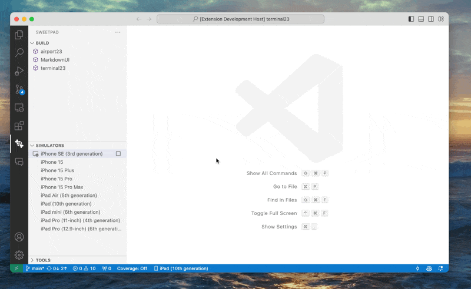

# SweetPad (iOS/Swift development) 

📚 [Documentation](https://sweetpad.hyzyla.dev/) | 📦
[VSCode Marketplace](https://marketplace.visualstudio.com/items?itemName=sweetpad.sweetpad) | 🐞
[Github Issues](https://github.com/sweetpad-dev/sweetpad/issues) | 🏔️ [Roadmap](https://github.com/sweetpad-dev/sweetpad/blob/main/TODO.md)

<!--  -->

You can support this project by giving a star on GitHub ⭐️ or by becoming an official sponsor 💰

<!--  -->

Develop Swift/iOS projects using VSCode or Cursor.

The long-term goal is to make VSCode/Cursor a viable alternative to Xcode for iOS development by integrating open-source
tools such as **swift-format**, **swiftlint**, **xcodebuild**, **xcrun**, **xcode-build-server**, **sourcekit-lsp**.

## Feature

- ✅ **[Autocomplete](https://sweetpad.hyzyla.dev/docs/autocomplete)** — setup autocomplete using
  [xcode-build-server](https://github.com/SolaWing/xcode-build-server)
  
- 🛠️ **[Build & Run](https://sweetpad.hyzyla.dev/docs/build)** — build and run application using
  [xcodebuild](https://developer.apple.com/library/archive/technotes/tn2339/_index.html)
  
- 💅🏼 **[Format](https://sweetpad.hyzyla.dev/docs/format)** — format files using
  [swift-format](https://github.com/apple/swift-format) or other formatter of your choice
  
- 📱 **[Simulator](https://sweetpad.hyzyla.dev/docs/simulators)** — manage iOS simulators
  
- 📱 **[Devices](https://sweetpad.hyzyla.dev/docs/devices)** — run iOS applications on iPhone or iPad
 
- 🛠️ **[Tools](https://sweetpad.hyzyla.dev/docs/tools)** — manage essential iOS development tools using
  [Homebrew](https://brew.sh/)
  
- 🪲 **[Debug](https://sweetpad.hyzyla.dev/docs/debug)** — debug iOS applications using
  [CodeLLDB](https://marketplace.visualstudio.com/items?itemName=vadimcn.vscode-lldb)
  
- ✅ **[Tests](https://sweetpad.hyzyla.dev/docs/tests)** — run tests on simulators and devices
  

> 💡 If you have any ideas, please open an issue or start a discussion on the
> [SweetPad](https://github.com/sweetpad-dev/sweetpad) GitHub repository.

## Requirements

1. 🍏 MacOS — other platforms are currently not supported
2. 📱 Xcode — required for building and running iOS apps via `xcodebuild`

## Changelog

The [CHANGELOG.md](./CHANGELOG.md) contains all notable changes to the "sweet pad" extension.

## License

This extension is licensed under the [MIT License](./LICENSE.md).
